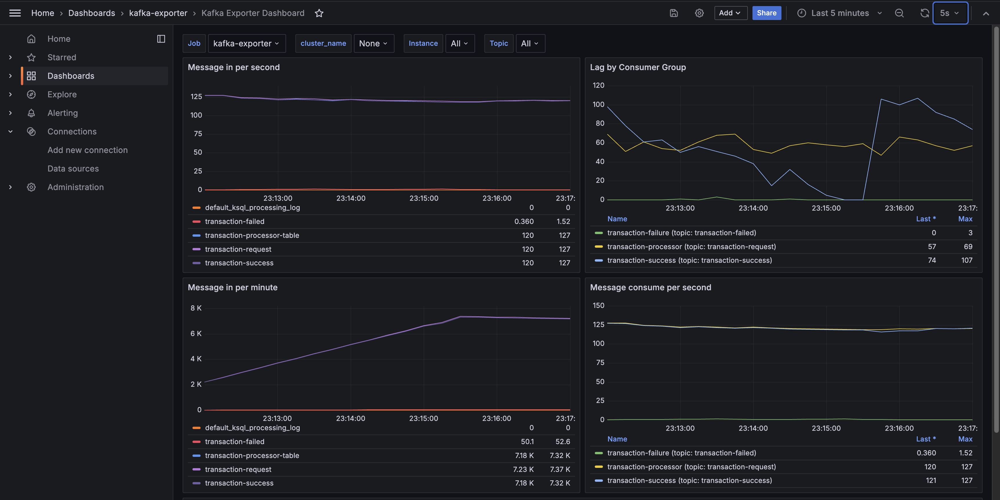

A Go implementation of the examples from the Kafka In Action book.

# Usage

Before executing any commands from the chapters, start the Kafka cluster by running the following command (it takes some time to start all the services):

```bash
cd docker && docker-compose up -d
```

The [chapters](./chapters) folder is mounted to all broker containers under `/kafka-in-action`, so changes in the related files made inside the containers will be reflected on the host and vice versa.

Many commands need to be executed in the Kafka broker containers. Connect to a broker's terminal and execute the following command before running any Kafka command:

```bash
unset KAFKA_JMX_OPTS && unset JMX_PORT
```

This will reset the default JMX configuration that is already occupied by the broker to avoid conflicts. This is scoped to the current terminal session only.

After that pick a chapter and follow the instructions in the chapter's README.md file. Some chapters are omitted in this repo because there is nothing to execute in them in the current setup (e.g. chapter 8 just gives a quick overview of different tools like Apache Flume, Red Hat Debezium, Secor, and a quick overview of some architectures).

## Grafana and Prometheus

Grafana and Prometheus are also available to monitor the Kafka cluster. You can access Grafana at http://localhost:3000 (credentials: admin/admin) and Prometheus at http://localhost:9090.

There is a pre-configured dashboard Kafka Exporter Dashboard you can use for monitoring Kafka metrics in Grafana.

To display some data you need to produce and consume some data first so the relevant metrics are created and the dashboard can build the labels. For example, you can follow the instructions in the [README.md](./chapters/chapter12/usingGo/README.md) file of chapter 12 to produce and consume some data and then check the metrics in Grafana:


